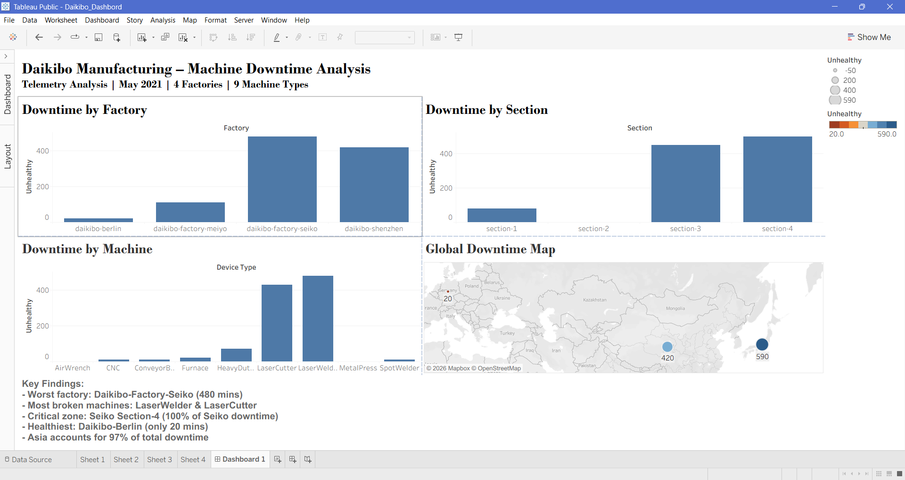

# Deloitte-Data-Analytics-Forage
# Deloitte Australia Data Analytics Job Simulation
**Platform:** Forage | **Completed:** June 2026  
**Certificate:** [View Certificate](https://www.theforage.com/completion-certificates/9PBTqmSxAf6zZTseP/io9DzWKe3PTsiS6GG_9PBTqmSxAf6zZTseP_GwuamxeFb4pB2GFDu_1780396940967_completion_certificate.pdf)

---

## Overview
Acted as a Data Analyst at Deloitte Australia to solve two 
real-world business problems for Daikibo Industrials — 
a global manufacturing company.

---

## Task 1 — Machine Downtime Analysis (Tableau)
**Business Question:** Which factory had the most machine 
downtime? Which machines broke most often?

**Approach:**
- Imported telemetry JSON data (160,704 records) into Tableau
- Created calculated field: IF Status = "unhealthy" THEN 10 ELSE 0
- Built interactive dashboard with factory-level filter

**Key Findings:**
- Daikibo-Factory-Seiko → highest downtime (480 mins)
- LaserWelder & LaserCutter → most problematic machines
- Seiko Section-4 → caused 100% of factory downtime
- Asia accounts for 97% of total downtime

**Tools:** Tableau Public

---

## Task 2 — Gender Pay Equality (Excel)
**Business Question:** Are salaries fair across job roles 
and factory locations?

**Approach:**
- Classified 37 job roles using Excel nested IF formula
- `=IF(ABS(C2)>20,"Highly Discriminative",IF(ABS(C2)>10,"Unfair","Fair"))`

| Class | Criteria |
|---|---|
| Fair | Score within ±10 |
| Unfair | Score between ±10 and ±20 |
| Highly Discriminative | Score beyond ±20 |

**Tools:** Microsoft Excel

---

## Dashboard Preview

---

## My Other Projects
| Project | GitHub | Blog |
|---|---|---|
| Pan-India Restaurant Market Intelligence | [GitHub](https://github.com/saimmi/swiggy-market-intelligence) | [Blog](https://saimmi.github.io/swiggy-market-intelligence/) |
| Customer Segmentation (RFM + KMeans) | [GitHub](https://github.com/saimmi/Customer-segmentation-analysis-) | [Blog](https://saimmi.github.io/Customer-segmentation-analysis-/) |
| Zepto Inventory & Pricing Analysis | [GitHub](https://github.com/saimmi/zepto-sql-business-analysis) | [Blog](https://saimmi.github.io/zepto-sql-business-analysis/) |

---

## Connect With Me
- 🌐 Portfolio: [saimmi.github.io/Saimmi_Nisha](https://saimmi.github.io/Saimmi_Nisha/)
- 💼 LinkedIn: [S. Nisha](https://www.linkedin.com/in/s-nisha-31a78b212/)
- 📧 Email: saimminisha218@gmail.com
- 🐙 GitHub: [github.com/saimmi](https://github.com/saimmi)
